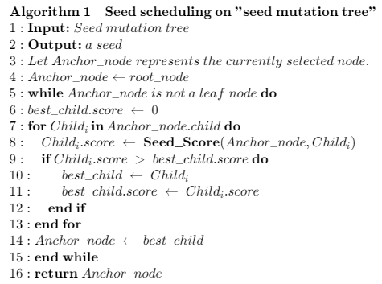
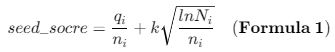

# The implementation of Alphuzz
This is an implementation of Alphuzz.

**Changes for data structure.** 

We changed the queue structure of AFL into a tree structure. Specifically, we construct a seed mutation tree during fuzzing process based on the mutation relationships among seeds. For example, if Alphuzz mutates seed A and generates a new seed B. If seed B is an interesting inputs, we add it to the tree as a child node of A.

**Changes for seed scheduling strategy.** 

We propose a new seed scheduling strategy based on the MCTS algorithm. First, starting from the root node, we label the currently selected node as the anchor node. Then, we calculate 𝑠𝑒𝑒𝑑_𝑠𝑐𝑜𝑟𝑒 for every child node of the anchor node. Then, we recursively select the child node with the highest 𝑠𝑒𝑒𝑑_𝑠𝑐𝑜𝑟𝑒 as the new anchor node until a leaf node is reached. 
**Algorithm 1** shows the detailed process of seed scheduling. 



We leverage the UCT algorithm to calculate the score of seed. **Formula 1** shows the calculation of 𝑠𝑒𝑒𝑑_𝑠𝑐𝑜𝑟𝑒.



# Installation instructions

The installation is the same as AFL.

Compile the program with:
```bash
$ cd /path/to/Alphuzz
$ make
```
You can start using the fuzzer without installation, but it is also possible to
install it with:
```bash
$ make install
```

# Instrumenting binary-only apps

When source code is *NOT* available, the fuzzer offers experimental support for
fast, on-the-fly instrumentation of black-box binaries. This is accomplished
with a version of QEMU running in the lesser-known "user space emulation" mode.

QEMU is a project separate from AFL, but you can conveniently build the
feature by doing:

```bash
$ cd qemu_mode
$ sudo apt install libtool libtool-bin libglib2-dev zlib1g automake bison
$ ./build_qemu_support.sh
$ cd ../
$ make
```

For additional instructions and caveats, see qemu_mode/README.qemu.


# Fuzzing binaries


The fuzzing process itself is carried out by the afl-fuzz utility. This program
requires a read-only directory with initial test cases, a separate place to
store its findings, plus a path to the binary to test.

For target binaries that accept input directly from stdin, the usual syntax is:
```bash
$ ./afl-fuzz -i testcase_dir -o findings_dir /path/to/program [...params...]
```
For programs that take input from a file, use '@@' to mark the location in
the target's command line where the input file name should be placed. The
fuzzer will substitute this for you:
```bash
$ ./afl-fuzz -i testcase_dir -o findings_dir /path/to/program @@
```

You can also use the -f option to have the mutated data written to a specific
file. This is useful if the program expects a particular file extension or so.

Non-instrumented binaries can be fuzzed in the QEMU mode (add -Q in the command
line) or in a traditional, blind-fuzzer mode (specify -n).

You can use -t and -m to override the default timeout and memory limit for the
executed process; rare examples of targets that may need these settings touched
include compilers and video decoders.

Tips for optimizing fuzzing performance are discussed in perf_tips.txt.

Note that afl-fuzz starts by performing an array of deterministic fuzzing
steps, which can take several days, but tend to produce neat test cases. If you
want quick & dirty results right away - akin to zzuf and other traditional
fuzzers - add the -d option to the command line.


